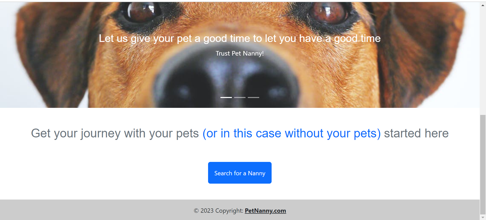
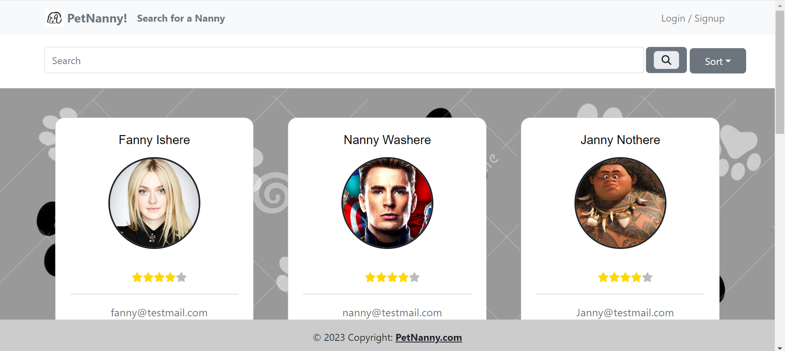
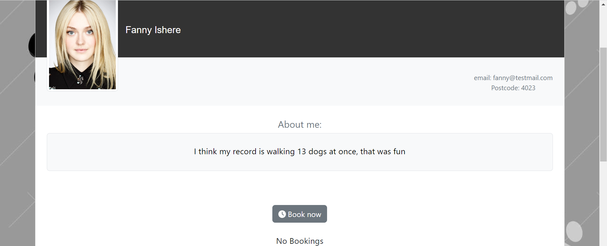
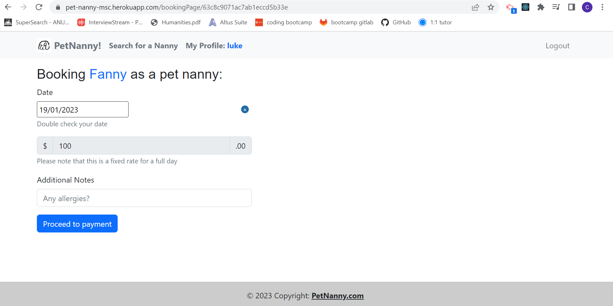
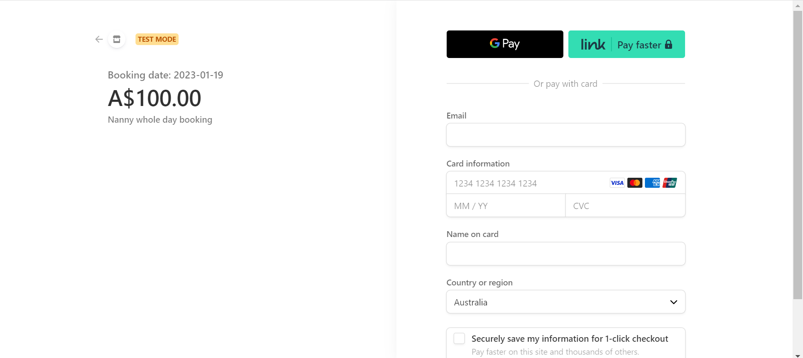

<div align="center">
<h1>Pet Nanny: A Booking App for Pet Care Services</h1>
<a name="readme-top"></a>
</div>

Deployed URL: [https://pet-nanny-msc.herokuapp.com/](https://pet-nanny-msc.herokuapp.com/)
 
<!-- TABLE OF CONTENTS -->
  ## Table of Contents
  <ol>
    <li><a href="#screenshots">Screenshots</a></li>
    <li><a href="#description">Description</a></li>
    <li><a href="#usage">Usage</a></li>
    <li><a href="#installation">Installation</a></li>
    <li><a href="#technologies">Technologies</a></li>
    <li><a href="#license">License</a></li>
    <li><a href="#links">Links</a></li>
    <li><a href="#credits">Credits</a></li>
    <li><a href="#roadmap">Roadmap</a></li>
  </ol>
  
<!-- Screenshots -->
## Screenshots
```Homepage```
<br>



<br>

```Nanny Search Page```


<br>

```Nanny Profile Page```


<br>

```Booking Page```


<br>

```Payment Page```



<p align="right">(<a href="#readme-top">back to top</a>)</p>

## Description

PetNanny is a web application that allows users to find and book nannies for their pets at affordable prices. Users can browse through a list of available nannies, view their profiles and ratings, select a date and time for the booking, and pay securely online.

Users can sign up for PetNanny with two different roles: parent or nanny.

- <strong>Parents</strong> are users who want to book nannies for their pets. They can view all the nannies on the platform, filter them by location and availability, and make bookings with their preferred nannies.
- <strong>Nannies</strong> are users who offer pet care services. They can create their own profiles with their rates, skills, experience, and availability. They can also accept or decline bookings from parents.

<p align="right">(<a href="#readme-top">back to top</a>)</p>

<!-- Usage -->
## Usage

```To use PetNanny as a parent:```

- Sign up or log in with your email and password
- Choose “Parent” as your role
- Browse through the list of nannies
- Click on a nanny’s name to view their profile
- Click on “Book Now” to make a booking
- Select a date and time from the calendar
- Enter your payment details
- Confirm your booking

```To use PetNanny as a nanny:```

- Sign up or log in with your email and password
- Choose “Nanny” as your role
- Fill out your profile with your information
- Check your dashboard for incoming bookings

<p align="right">(<a href="#readme-top">back to top</a>)</p>

<!-- Installation -->
## Installation

Clone this repository: 

```
git clone git@github.com:mecuboi/pet-nanny.git
```

Install the dependencies on the root directory: 
```
npm install
```

Start the server:
```
npm run develop
```

Open your browser and go to [http://localhost:3001](http://localhost:3001)

<!--Technologies used-->
## Technologies

<p align="center">
  <a href="https://skillicons.dev">
    
  </a>
</p>

<p align="right">(<a href="#readme-top">back to top</a>)</p>

## License

[](https://github.com/mecuboi/pet-nanny/blob/main/LICENSE)

Distributed under the MIT License. See `LICENSE.txt` for more information.

<p align="right">(<a href="#readme-top">back to top</a>)</p>

<!--Links-->
## Links

* Deployed URL - https://pet-nanny-msc.herokuapp.com/
* GitHub Repository - https://github.com/KangaZero/pet-nanny

<p align="right">(<a href="#readme-top">back to top</a>)</p>
 
<!--Credits-->
## Credits

We would like to acknowledge and credit all contributors.
1. Matthew Dharmawan Jusuf [https://github.com/mecuboi](https://github.com/mecuboi) 
2. Chibuike Okoye [https://github.com/Notchibby](https://github.com/Notchibby)
3. Samuel Wai Weng Yong [https://github.com/KangaZero](https://github.com/KangaZero)

<p align="right">(<a href="#readme-top">back to top</a>)</p>

<!-- Roadmap -->
## Roadmap

We are constantly working on improving PetNanny and adding new features. Some of our future plans include:

- Adding reviews and ratings for nannies
- Implementing chat functionality between parents and nannies
- Integrating Google Maps API for location-based services

If you have any suggestions or feedback for us, please feel free to share them via email:
[Send feedback](mailto:samuelyongw@gmail.com)

<p align="right">(<a href="#readme-top">back to top</a>)</p>
 
<p align="center">Thanks for reading 😄!</p>

